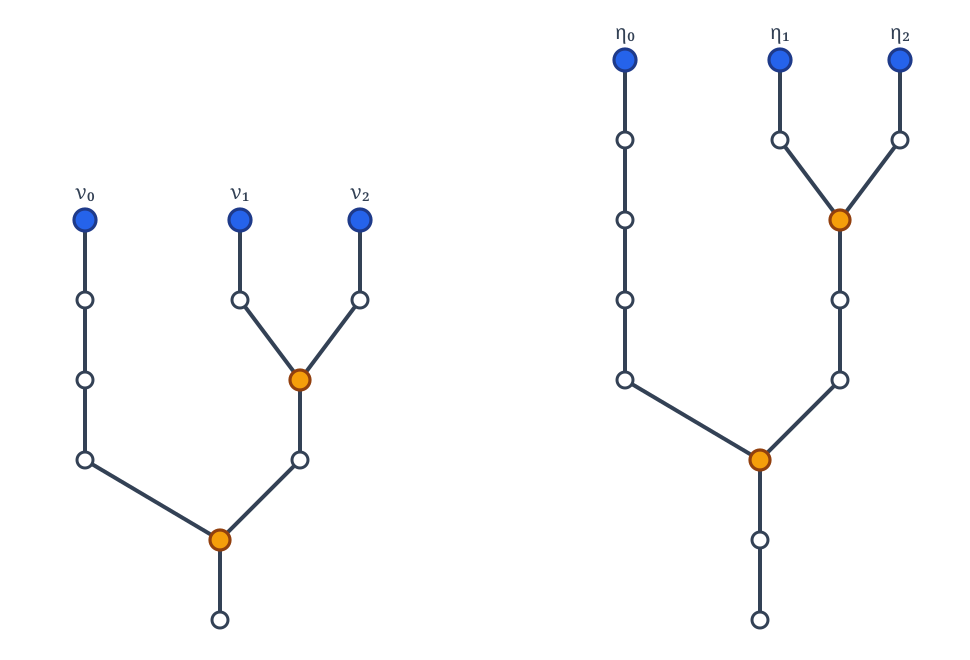
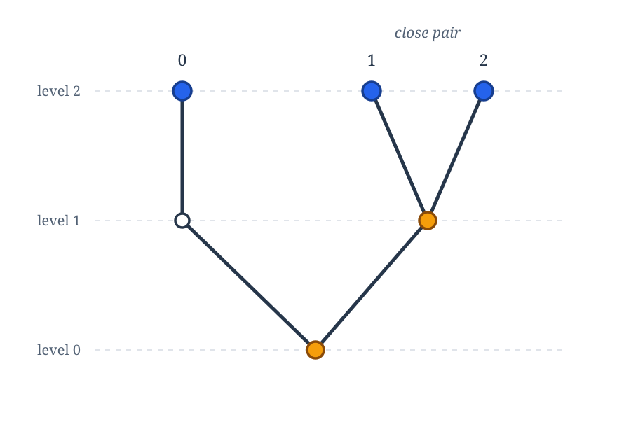
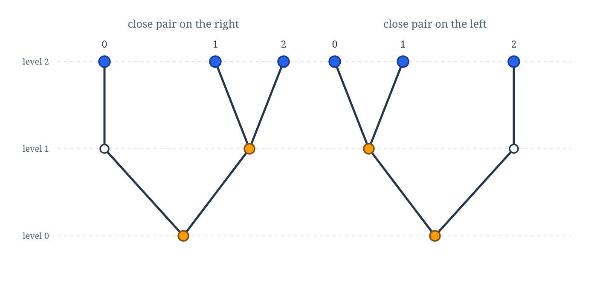
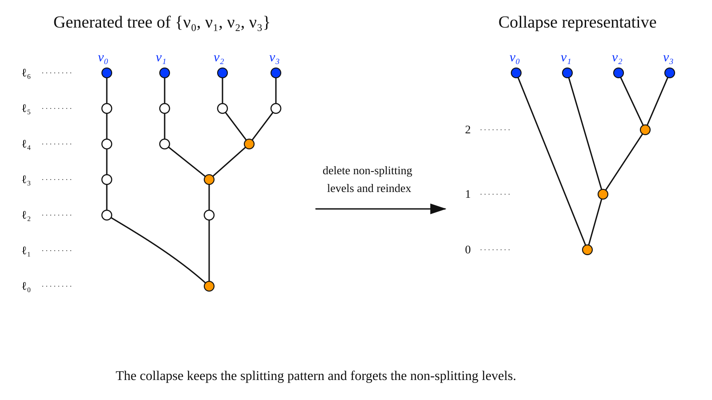
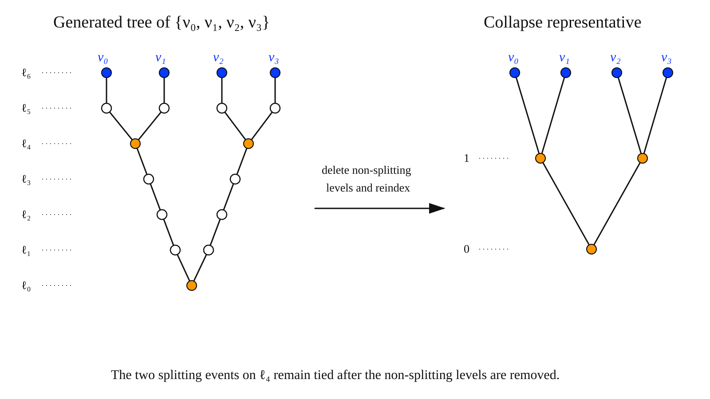

# Similarity

## The Similarity Relation

Strong similarity remembers the actual levels at which the branches split. For our final canonization theorem, this is more information than we want. What matters is only the relative pattern of the splitting levels: which split occurs first, which occurs next, and so on.

Thus, two leveled configurations will be called **similar** if they have the same branching pattern after we forget the numerical values of the splitting levels and remember only their relative order. Equivalently, similarity identifies configurations that become strongly similar after an order-preserving relabeling of the relevant levels of the tree.

!!! definition "Similarity"

    Suppose $\bar\nu=\langle \nu_0,\ldots,\nu_{n-1}\rangle$ and $\bar\eta=\langle \eta_0,\ldots,\eta_{n-1}\rangle$
    enumerate $n$-element subsets of levels $2^m$ and $2^{m'}$, respectively.

    We say that $\bar\nu$ and $\bar\eta$ are **similar** if the following hold.

    * For every $i,j,k,\ell<n$, $\Delta(\nu_i,\nu_j)<\Delta(\nu_k,\nu_\ell)$ if and only if  $\Delta(\eta_i,\eta_j)<\Delta(\eta_k,\eta_\ell)$, and 
      

    * If $\alpha=\Delta(\nu_i,\nu_j)$ and $\beta = \Delta(\eta_i,\eta_j)$ then for every $k<n$, $\nu_k(\alpha)=\eta_k(\beta)$.

    Thus corresponding splitting events occur in the same relative order,
    and corresponding nodes pass to the same side of corresponding splits.

    For unordered leveled sets $a$ and $b$, we say that $a$ and $b$ are
    **similar** if their lexicographically increasing enumerations are similar.

Note that if two splitting events occur at the same level in one configuration, then the corresponding splitting events occur must occur at the same level in the other.  

??? example "Example: Similar Triples"

    The following triples $\{\eta_0,\eta_1,\eta_2\}$ and $\{\nu_0,\nu_1,\nu_2\}$ are similar but not strongly similar.

    
    
    They have the same relative splitting pattern, although the actual levels at which they split are different.  The relative splitting pattern can be captured
    by removing all of the non-splitting nodes, arriving at the following pattern.

    

    In this configuration, the splitting of the two right nodes occurs later, so the **close pair** of the triple is on the right. On a skew tree, where each level can contain at most one splitting node, there are going to be two similarity types of triples:

    

    More generally, in a skew tree there are going to be at most $(n-1)!$ similarity types of unordered level $n$-sets, and at most $n!(n-1)!$ similarity types of ordered level $n$-tuples.  This last number should look familiar...

In general, the similarity type of an $n$-element leveled set $a$ can be represented by a finite binary tree with $n$ terminal nodes and exactly $n-1$ splitting nodes.  Essentially, we take the finite tree generated by $a$ and its meets, delete all levels at which no splitting occurs, and then reindex the remaining levels in increasing order.  The following gives us a couple of examples of how this works.

??? example  "Example: Canonical representatives of similarity types"
    We see this in action with the following example, where build the canonical representive of the similarity type of set of size $4$

    

    Here's another example, where this time the similarity type incorporates a tie:

    

    What is important, though, is that this shows us there are only finitely many possible similarity types for leveled $n$-sets.   Do not quote me on this, but if $t_n$ is th number of unordered leveled $n$-sets then (I think...)

    $$
    t_1 =1,\qquad\qquad t_n = \sum_{j=1}^{\lfloor n/2\rfloor}\binom{n-j}{j}t_{n-j},
    $$

    and if we take order into account the number is $n! t_n$. Again, all that matters to us is that this is finite.

Given a representative of the similarity type of \(a\), the additional information needed to determine its strong similarity type consists of the actual levels at which its splitting events occur and the common height of the nodes in \(a\). Order the \(n-1\) splitting nodes of the representative by shortlex and record their actual levels in that order. This produces a finite nondecreasing sequence of natural numbers, with repeated entries corresponding precisely to ties. Together with the common height of the members of \(a\), this sequence determines the strong similarity type of \(a\).  Thus, the strong-similarity data can be coded by a sequence $\langle \ell_0,\dots,\ell_{n-2}, m\rangle$, where $\ell_i$ is the actual level of the $i$-th splitting node in shortlex order, and $m$ is the common height of the members of $a$.

## Homogeneous Colorings

We come now to the final canonization theorem that we will need.  Recall that previously we defined when a coloring was almost homogeneous by 

An $n$-dimensional level coloring $d$ is **homogeneous** on $T$ if it is constant on similarity classes of leveled $n$-sets in $T$. 

!!! proposition Proposition
    Let $d$ be an $n$-dimensional finite level coloring that is almost homogeneous on a perfect strong subtree $T$ of $2^{<\omega}$.  Then there is a perfect strong subtree $S$ of $T$ such that $d$ is homogeneous on $S$.

**Proof:**

Let $\tau$ be a similarity type involving, say, $r\leq n-1$ distinct splitting levels.  Given an increasing sequence $\ell_0<\dots<\ell_r$ of indices from splitting levels of $T$

$$
\tag*{$\square$}
$$

